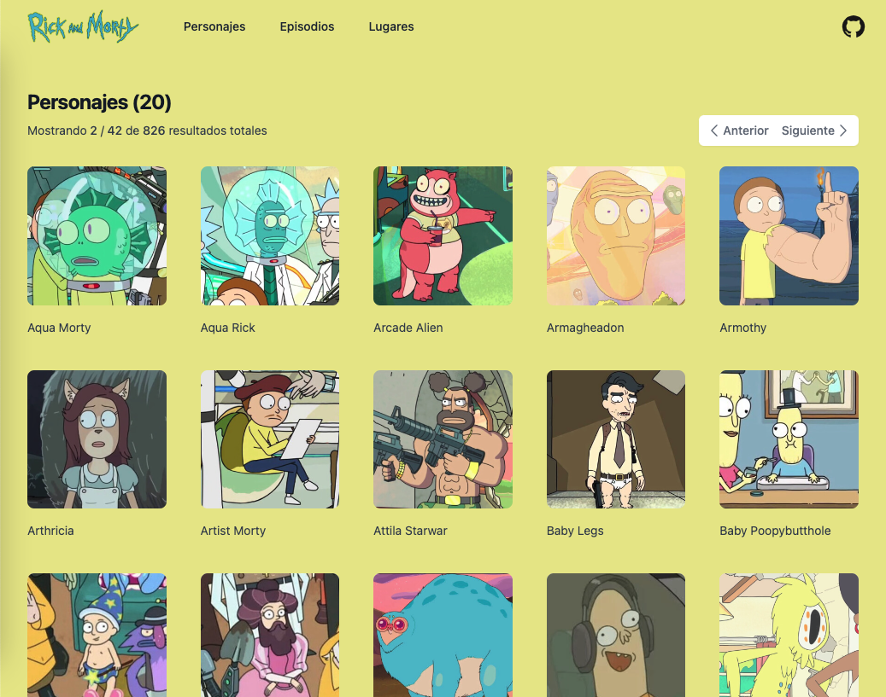

<!-- [![Contributors][contributors-shield]][contributors-url] -->

[![Forks][forks-shield]][forks-url] [![Stargazers][stars-shield]][stars-url]
[![Issues][issues-shield]][issues-url] [![MIT License][license-shield]][license-url]
[![LinkedIn][linkedin-shield]][linkedin-url]

<!-- PROJECT LOGO -->
 

  <h1 align="center">Rick and Morty web for Gentleman Programming Hackathon</h1>

  

    Bussiness idea: build a website for the fandom of Rick and Morty series where the users can find all characters, episodes and locations. Profit is gained throught satisfying the fandom and engaging more users. Next level might be adding an ecommerce where users can buy Rick and Morty stuff.     
     
    <!-- <a href="https://github.com/aireck2/rm-vite-ts"><strong>Explore the docs »</strong></a>
      -->
    <!--   -->
    <a href="https://rick-y-morty-aireck.vercel.app/">View Demo</a>
    ·
    <a href="https://github.com/aireck2/rm-vite-ts/issues">Report Bug</a>
    ·
    <a href="https://github.com/aireck2/rm-vite-ts/issues">Request Feature</a>
  

 

## 🚀 Instructions / How to start the project

1. Downloard/clone the git repository
2. Open terminal/command prompt
3. cd (change directory) into the project folder
4. Run `npm install` in your terminal
5. Run `npm run dev` to run the frontend
6. Open your browser and navigate to `http://localhost:5173/`

   **Make sure to add yours env vars in .env file as is shown in .env.test file**

## Contributing

Contributions are what make the open source community such an amazing place to be learn, inspire,
and create. Any contributions you make are **greatly appreciated**.

Please contribute using [Github Flow](https://guides.github.com/introduction/flow/). Create a
branch, add commits, and [open a pull request](https://github.com/aireck2/portfolio-ts/compare/).

<!-- 1. Fork the Project
2. Create your Feature Branch (`git checkout -b feature/AmazingFeature`)
3. Commit your Changes (`git commit -m 'Add some AmazingFeature'`)
4. Push to the Branch (`git push origin feature/AmazingFeature`)
5. Open a Pull Request -->

<!-- LICENSE -->

## License

Distributed under the MIT License. See `LICENSE` for more information.

<!-- CONTACT -->

## Contact

Erick Escriba - [@erickescribaa](https://twitter.com/erickescribaa) - erickescribaa@gmail.com

Project Link: [https://github.com/aireck2/rm-vite-ts](https://github.com/aireck2/rm-vite-ts)

[contributors-shield]: https://img.shields.io/github/contributors/aireck2/rm-vite-ts.svg?style=for-the-badge
[contributors-url]: https://github.com/aireck2/rm-vite-ts/graphs/contributors
[forks-shield]: https://img.shields.io/github/forks/aireck2/rm-vite-ts.svg?style=for-the-badge
[forks-url]: https://github.com/aireck2/rm-vite-ts/network/members
[stars-shield]: https://img.shields.io/github/stars/aireck2/rm-vite-ts.svg?style=for-the-badge
[stars-url]: https://github.com/aireck2/rm-vite-ts/stargazers
[issues-shield]: https://img.shields.io/github/issues/aireck2/rm-vite-ts.svg?style=for-the-badge
[issues-url]: https://github.com/Aireck2/rm-vite-ts/issues
[license-shield]: https://img.shields.io/github/license/aireck2/rm-vite-ts.svg?style=for-the-badge
[license-url]: https://github.com/aireck2/portfolio-next/blob/develop/LICENSE
[linkedin-shield]: https://img.shields.io/badge/-LinkedIn-black.svg?style=for-the-badge&logo=linkedin&colorB=555
[linkedin-url]: https://linkedin.com/in/erickescriba
[product-screenshot]: images/screenshot.png
